# Campanhas Ativas

## Campanha Ativa
Uma campanha ativa é uma oferta promocional que já foi criada e está em vigor, disponível para os usuários. No sistema de Campanha Rápida, as abas em verde indicam os canais onde a promoção está ativada e sendo veiculada, como aplicativo (App) e jornal, por exemplo. Os canais em cinza mostram opções que não estão ativas naquela campanha. Assim, é possível identificar rapidamente por quais meios a campanha está sendo divulgada.  

## Geral
A aba Geral indica que a oferta ou campanha é válida para todos os públicos, sem restrição a segmentos específicos. Isso significa que a promoção está disponível de forma ampla, alcançando todos os clientes, independentemente do canal de acesso.  

## App
A aba **App** dentro da Campanha Rápida é o local onde você define como a promoção será exibida dentro do aplicativo da loja. É o espaço dedicado para personalizar e ativar a oferta para os clientes que acessam as promoções pelo app.

No print, a aba App está verde, o que indica que a oferta está ativa e disponível nesse canal, garantindo que os usuários do aplicativo possam visualizar e aproveitar a promoção.  

## Ecommerce
Na campanha ativa, a aba **Ecommerce** permite ativar a funcionalidade "desconto por link", que vincula a promoção a um link específico.

Quando ativada, os clientes só conseguem ver e usar o preço promocional se acessarem esse link e ativarem a oferta por ele.  

### Link de ativação
O link de ativação é gerado automaticamente pela campanha quando a opção **"desconto por link"** está habilitada. É por meio dele que o cliente poderá ativar a oferta e garantir o valor promocional.

O desconto **só será aplicado** se a compra for feita após o acesso por esse link específico. Caso contrário, o preço normal será mantido.  

## Jornal de ofertas
O **jornal de ofertas** é um encarte promocional (impresso ou digital) usado para divulgar os principais produtos em promoção da loja, de forma atrativa e organizada. Ele ajuda o cliente a visualizar as ofertas e estimula a compra.  

### Considerar Paginação dos Produtos
A opção **"Considerar Paginação dos Produtos"** deve ser ativada quando os produtos foram organizados em páginas (ex: Página 1, Página 2) para que o jornal de ofertas respeite essa divisão. Caso não haja essa separação, a opção deve ser desativada.  
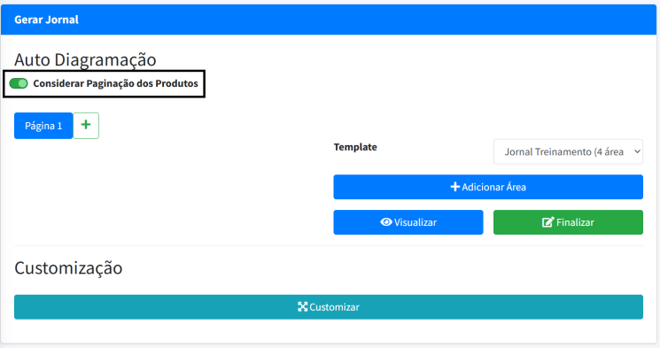

### Página do Jornal
A opção **“Página do Jornal”**, destacada na imagem, é onde você define em qual página do jornal aquele produto será exibido.  

### Template
O campo **"Template"** serve para escolher o modelo visual que será utilizado na criação do jornal de ofertas.  

### Adicionar Área
O botão **"Adicionar Área"** permite incluir novas seções (ou blocos) dentro do template selecionado no jornal de ofertas.  
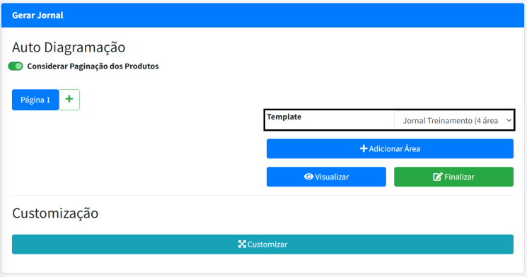

### Área
A **Área 1** é a primeira seção do template de jornal que você está montando. Nela, você configura como os produtos serão exibidos visualmente.

- **Layout Produto**: define o estilo de exibição dos produtos.  
- **Espaçamento (H x V)**: controla a distância entre os produtos.  
- **Tamanho do Grid (A x L)**: define a quantidade de produtos por linha e por coluna.  

### Visualizar
O botão **"Visualizar"** permite ver como o jornal ficará com as configurações escolhidas.  
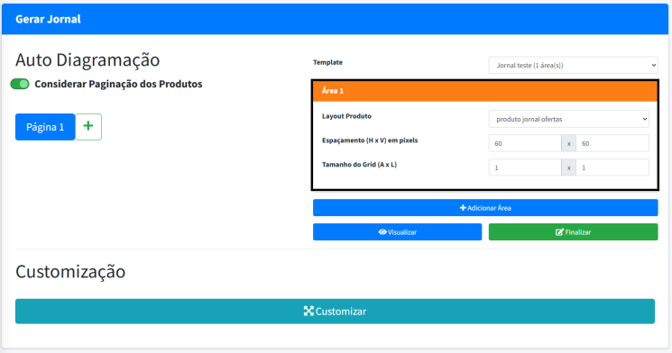

### Finalizar
O botão **"Finalizar"** é a etapa final da criação do jornal de ofertas.  
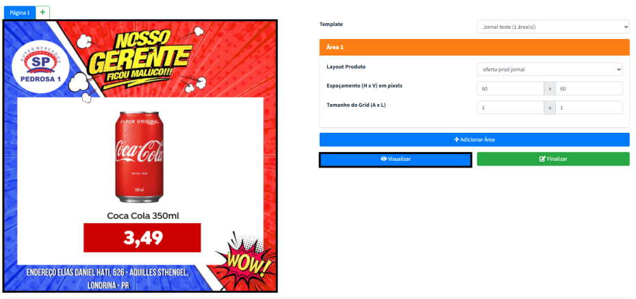

### Customização
A área de **Customização** permite montar o jornal diretamente pelo nosso portal.  
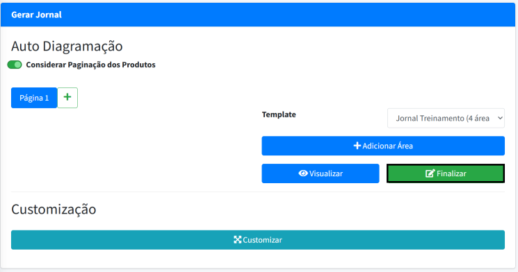

## Cartaz
O **cartaz** é um material impresso utilizado para destacar visualmente os produtos em oferta nos pontos de venda físicos.  
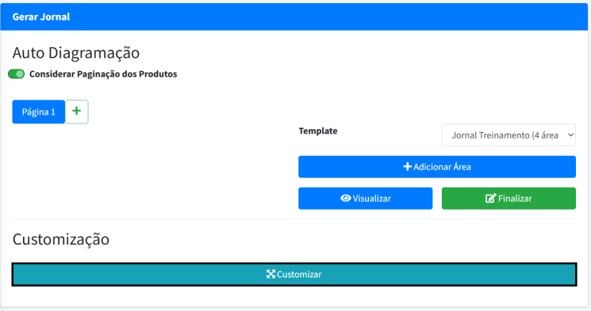

### Formato da página
Os botões **A1, A2, A3, A4, A5 e A6** representam as áreas de cartaz.  

### Escolher o tamanho da folha nos produtos
Para definir **em qual folha o produto será incluído no cartaz**, você deve ir até a **aba Produtos**.  

### Template do cartaz
A **seleção de template** permite escolher o **modelo visual** que será usado no cartaz.  
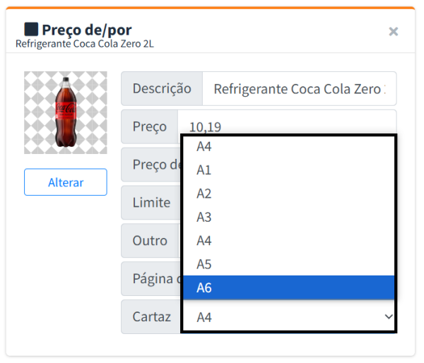

### Visualizar o cartaz
O botão **"Visualizar"** serve para ver uma prévia do cartaz.  

### Imagem por folha
A opção **"Imagens por folha"** define quantos produtos promocionais serão exibidos por página.  
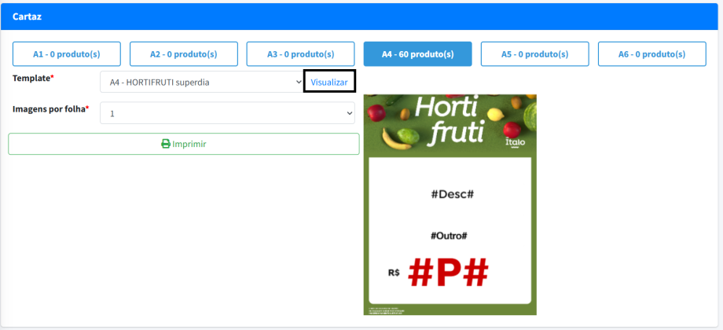

### Imprimir cartaz
O botão **"Imprimir"** permite gerar e imprimir os cartazes.  
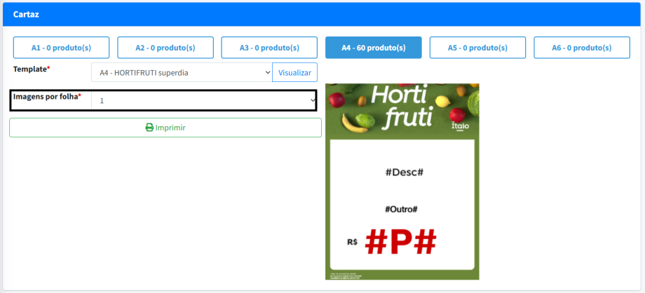

## CSV
Esse botão serve para exportar os dados da campanha em formato CSV e salvar no computador.  
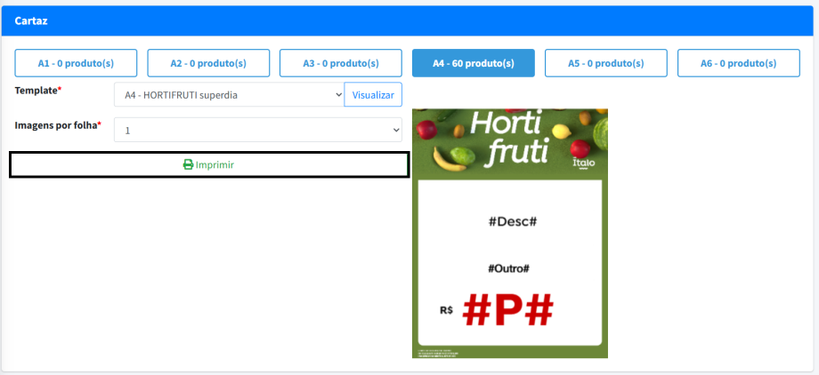

## Edição de campanha
Esse botão abre a tela para alterar os detalhes da campanha.  

### Título
O **título** é um texto que mostra qual campanha você está editando.  

### Botão vermelho
Esse botão serve para deletar toda a campanha.  
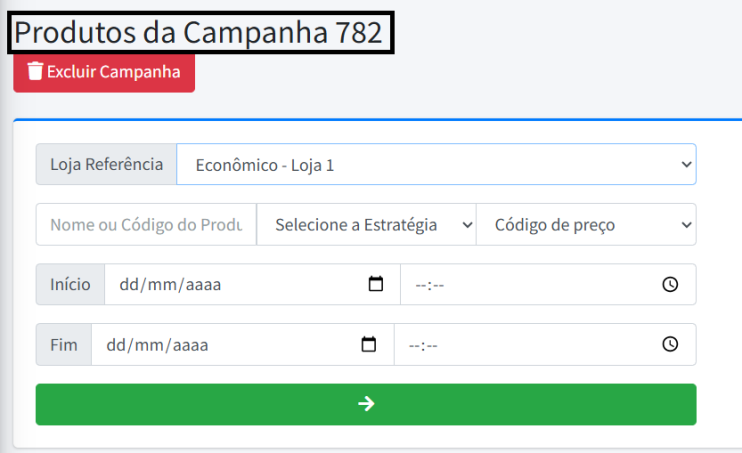

### Loja Referência
Um dropdown para escolher a loja relacionada à campanha.  
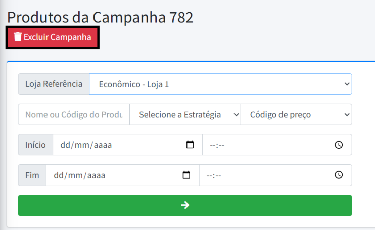

### Nome ou Código do Produto
Campo para buscar um produto específico.  
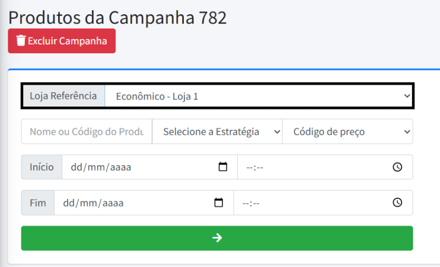

### Selecione a Estratégia
Dropdown com estratégias de preço para aplicar.  
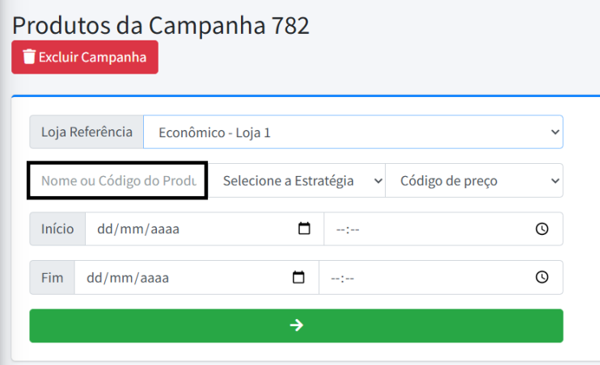

### Código de preço
Dropdown para escolher o código de preço do produto.  

### Datas e horários — Início e Fim
Campos onde você define quando a campanha começa e quando termina.  
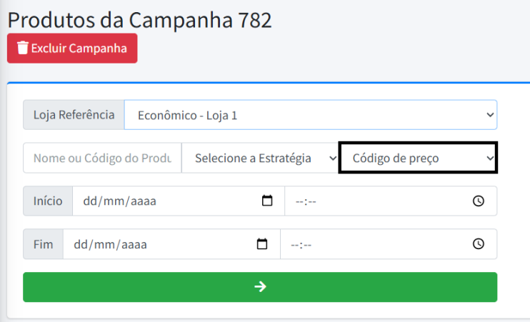

### Botão verde
Botão para confirmar as alterações ou adicionar os produtos.  
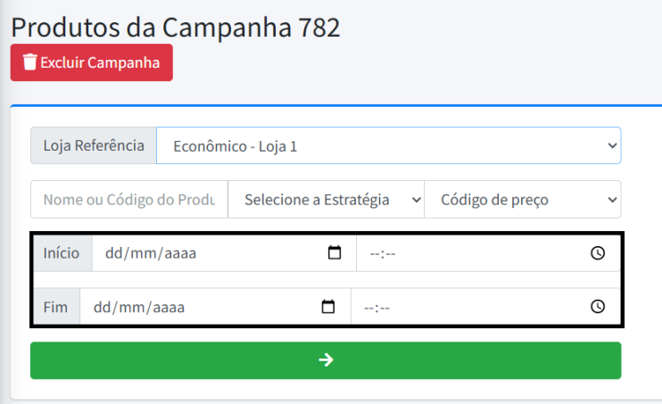